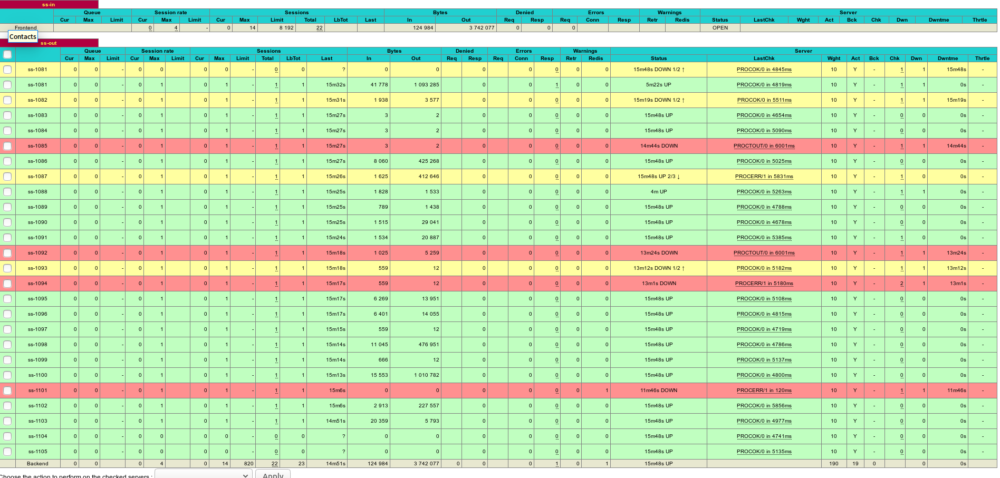

## Requirements

- [docker](https://docs.docker.com/install/)
- [docker-compose](https://docs.docker.com/compose/install/)
- [python](https://www.python.org/)


## Get starting 

```angular2
git clone https://github.com/sazima/ss-client.git
cd ss-client
vim client/config.json
```
 change config.json like this

```angular2
[
  {
    "server": "your server ip",
    "local_address": "0.0.0.0",
    "local_port": "1085",  
    "server_port": "2400",
    "password": "your password",
    "method": "aes-256-cfb",
    "protocol": "origin",
    "obfs": "plain"
  },
    {
    "server": "your server ip",
    "local_address": "0.0.0.0",
    "local_port": "1086",  
    "server_port": "2400",
    "password": "your password",
    "method": "aes-256-cfb",
    "protocol": "origin",
    "obfs": "plain"
  }
  ]
```

## run

```angular2
python config_init.py
docker-compose up
```
and then configure your application to use proxies `socks5://127.0.0.1:25502`


## others

- stop

```angular2
docker-compose down
```

- Monitoring information

open `http://192.168.0.113:1115/s` and get:




